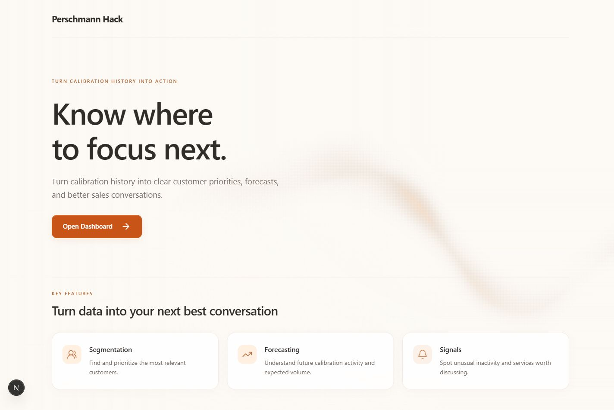
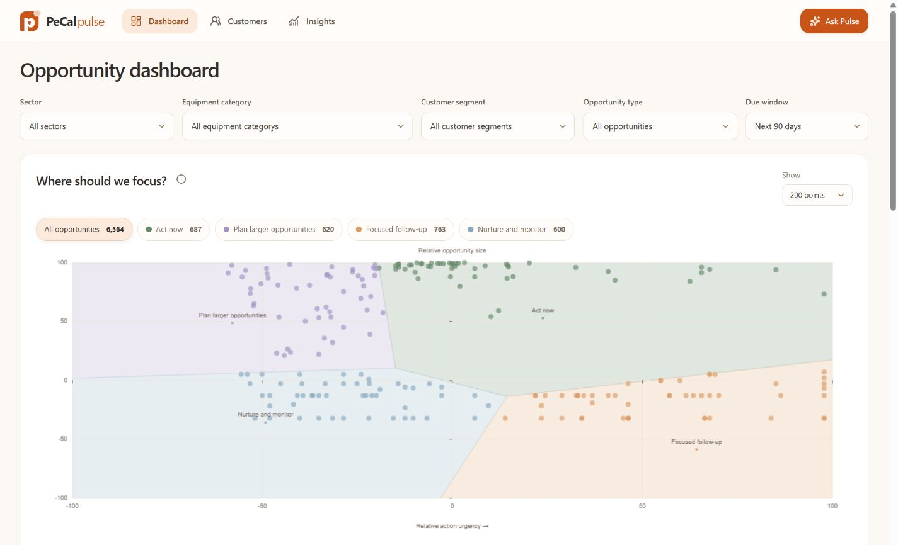
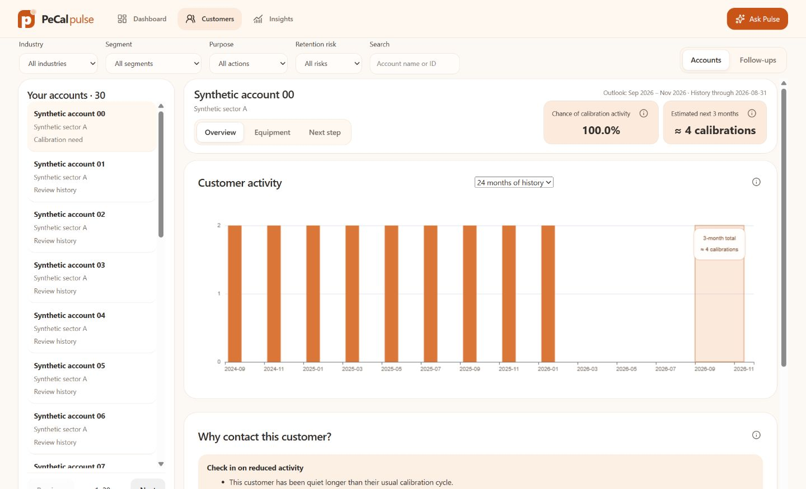
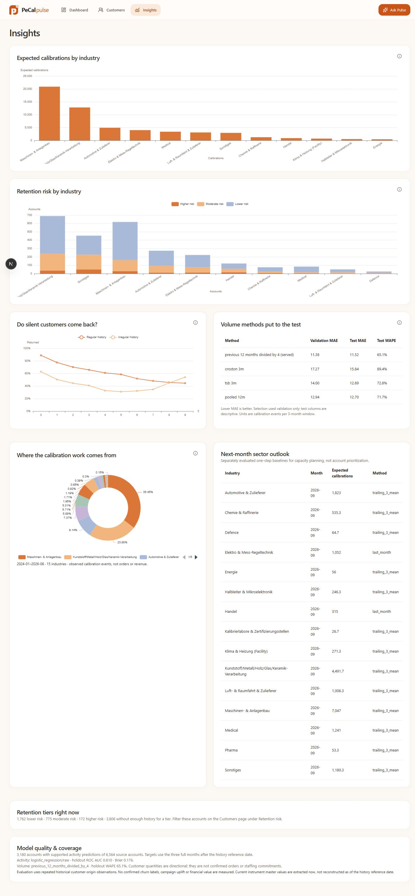

# PeCal Pulse

### From calibration history to better sales conversations

A sales intelligence workspace for **Perschmann Challenge 2: Customer Activity Monitoring**. Prioritize accounts, understand the evidence, prepare a conversation, and save the next step—all in one workspace.

**Next.js · FastAPI · LangGraph · ECharts · LiveKit**

[Quick start](#local-setup) · [Product tour](#product-tour) · [Configuration](#configuration) · [Data and privacy](#data-and-privacy)



## Product tour

### Opportunity dashboard

Find where to focus using a shared opportunity map, scoped metrics, and a ranked shortlist. Sector, equipment, segment, and due-window filters keep the evidence aligned.



### Customer intelligence

Review calibration history, forecast totals, equipment evidence, and conversation prompts. Record ownership and follow-ups separately from source history.



### Insights

Explore sector history, return behavior, and model coverage with explanations of what each estimate means.

<details>
<summary>View the Insights screenshot</summary>



</details>

*Desktop captures show the local prototype, including a synthetic customer example. Fresh narrow-screen captures are available below. Screenshots are illustrations, not live operational data. A fresh clone starts with the included synthetic fixture; private exports are not distributed.*

<details>
<summary>Fresh narrow-screen screenshots</summary>

[Landing](docs/screenshots/landing.jpg) · [Dashboard](docs/screenshots/dashboard.jpg) · [Customers](docs/screenshots/customers.jpg) · [Insights](docs/screenshots/insights.jpg)

</details>

## Implemented features

- **Dashboard:** opportunity map, ranking, sector/equipment/segment filters, due windows, scoped metrics, and account preparation previews. Plot samples do not change full-cohort totals.
- **Customers:** searchable accounts, calibration history, equipment evidence, activity/volume estimates, retention signals, and local next steps. Follow-ups are accessible inside Customers; `/follow-ups` remains a compatibility route.
- **Insights:** sector history/outlook, return curves, retention tiers, model comparisons, and coverage disclosures. Missing evidence is shown as unavailable.
- **Pulse assistant:** streamed chat and persisted history, with registered tools for navigation, filters, customer selection/previews, view controls, ownership, follow-ups, review checks, and draft emails. Drafting does **not** send email or write to the source SQL database.
- **Chat charts:** supported charts appear inside their original messages, including restored history. Maximize opens a larger view; Minimize or Escape returns to chat.
- **English/German voice:** push-to-talk transcription, automatic submission, existing workspace actions, and spoken replies. The compact voice panel leaves room for messages and charts.
- **Landing page:** one Open Dashboard action and the animated background wave, with reduced-motion support.

## Stack

Next.js 15, React, TypeScript, Zustand, assistant-ui, and ECharts on the frontend. FastAPI, LangChain/LangGraph, OpenRouter, SQLite persistence, and offline scikit-learn analytics on the backend. LiveKit streams voice over WebRTC.

## Local setup

Requirements: **Python 3.13+**, `uv`, a Node.js version compatible with Next.js 15, and `pnpm` (the frontend declares `pnpm@11.21.0`). SQL extraction additionally requires a SQL Server ODBC driver; the synthetic fixture and SQLite import do not.

From the repository root:

```powershell
uv sync
pnpm --dir frontend install
Copy-Item .env.example .env
```

Copy the template only if `.env` does not already exist. Put credentials in the ignored **root** `.env`; never commit it.

Start services in separate terminals:

```powershell
# Terminal 1 — repository root
uv run uvicorn backend.app.main:app --host 127.0.0.1 --port 8001 --reload --reload-dir backend
```

```powershell
# Terminal 2 — repository root
pnpm --dir frontend dev
```

With Bash available, `bash scripts/dev.sh` starts both instead.

- App: [http://127.0.0.1:3000](http://127.0.0.1:3000)
- API docs: [http://127.0.0.1:8001/docs](http://127.0.0.1:8001/docs)

The frontend proxies `/api/sales/*` to backend `/api/*`. `BACKEND_URL` overrides the frontend proxy destination. Restart the API after environment changes. Avoid duplicate processes on these ports.

For a production frontend preview, stop the frontend before building its `.next` directory:

```powershell
pnpm --dir frontend build
pnpm --dir frontend start
```

The backend still runs separately.

## Configuration

| Variable | Purpose |
| --- | --- |
| `OPENROUTER_API_KEY` | Enables chat. Without it, the data workspace can run but the assistant is unavailable. |
| `LLM_MODEL` | Configured OpenRouter model identifier; no model is hardcoded in the agent. |
| `RESONING_LVL` | Reasoning effort, default `low`. This spelling is intentional. |
| `LIVEKIT_URL`, `LIVEKIT_API_KEY`, `LIVEKIT_API_SECRET` | Enable voice. LiveKit Cloud inference access is required. |
| `PECAL_SNAPSHOT` | Snapshot to serve; defaults to the included `synthetic-v1` fixture. |
| `PECAL_ANALYTICS_ROOT` | Published analytics root; use `data/runtime/analytics-v3` for the v3 pipeline. |
| `CHECKPOINT_PATH` | Agent checkpoints, default `data/runtime/chat-checkpoints.sqlite3`. |
| `PECAL_DEMO_DB` | Workflow persistence, default `data/runtime/demo.sqlite3`. |
| `PECAL_TODAY` | Workflow reference date override. Current default is `2026-10-07`, not automatically today's date. |

`DAYTONA_API_KEY` in the template is reserved; arbitrary sandbox execution is not implemented.

### Voice assistant

Open **Ask Pulse** and select **EN · English** or **DE · Deutsch**. Hold Space to speak, then release to send automatically. Alternatively, tap the orb to start and tap again to send. The recognized transcript appears in chat. Pulse acknowledges the request, runs the same agent/tools as typed chat, and speaks the opening summary of the completed answer (up to 600 characters). Details, tool traces, and charts remain in chat.

The selection is remembered locally and controls **Deepgram Nova-3 transcription**, **Cartesia Sonic-3 speech**, and the current agent reply. Switching language creates a fresh voice session; previous messages are not translated. The visible textbox has been removed to maximize room for messages and charts; recognized voice transcripts remain in chat.

Tap the active orb to stop a response; starting a new spoken turn interrupts the current response. The speaker button tests output or replays the latest reply. The default microphone is used. A speaker-output selector appears when the browser supports routing and multiple outputs are detected; otherwise audio follows the system default.

Recording stops on release and is capped at 44 seconds. Closing the assistant or starting a new conversation disconnects voice. Audio streams over WebRTC and is not saved by this app; transcripts are stored in chat history. Credentials remain server-side; the browser receives a short-lived room-scoped token. Microphone permission and provider availability are required. Speech recognition can mishear words; generated-audio checks do not guarantee accuracy on a user's microphone.

## Data and privacy

A fresh clone uses **explicit synthetic data**. Private exports, snapshots, trained artifacts, workflows, chat history, and credentials are excluded from Git and are not bundled with this branch.

The API serves a **published snapshot**, not live SQL queries. SQL credentials are used by read-only exporters. New source data appears only after export, snapshot publication, and analytics generation.

The currently prepared local workspace uses the authorized SQLite export from `PeCalHackathon2026.zip`:

| Item | Prepared local workspace |
| --- | --- |
| Snapshot | `offline-sql-20260831-20261007` |
| History reference | `2026-08-31` |
| Customer forecast window | September–November 2026 |
| Accounts / industries | 6,564 / 15 |
| Supported activity forecasts | 3,180 |
| Analytics root | `data/runtime/analytics-v3` |

September in the export is partial and excluded from complete-month history. This is an **offline export**, not evidence of a working live SQL connection. These private local files are not included in Git.

### Refresh source data

See [Data refresh guide](docs/data-refresh.md) for read-only extraction, immutable snapshot publication, analytics generation, and verification. Keep exports and generated artifacts in ignored local directories.

## Analytics meanings and limits

- Activity probability means **at least one observed calibration in the next three complete months**, not conversion, confirmed churn, or outreach benefit.
- Customer volume is a **three-month total**. Charts show history followed by a shaded forecast window; no monthly customer forecasts or confidence intervals are invented.
- On the prepared local snapshot, logistic activity prediction has holdout ROC AUC **0.810** and Brier error **0.176**. The selected quantity model is the previous 12 months divided by four, with holdout WAPE approximately **65.1%**. WAPE is aggregate error, not individual account accuracy. Consult each snapshot's model report.
- Retention signals use empirical return behavior after silence. Peer equipment differences suggest discovery questions, not proof of ownership or competitor use.
- Calibration events, instruments, and orders are different units. A passed due date does not prove unfinished work. Inferred dates are labelled separately.
- Priority scores are relative, not euros. Financial scenarios are an optional backend capability outside the main sales UI.
- Live CRM quotations, verified contacts/revenue/margins, confirmed churn labels, causal outreach uplift, and arbitrary code execution are not implemented or established by the source data.

## Checks

From the repository root:

```powershell
uv run python -m unittest discover -s backend/tests -q
pnpm --dir frontend exec node --test tests/audio-output.test.mjs tests/voice-livekit.test.mjs tests/voice-panel.test.mjs
pnpm --dir frontend typecheck
pnpm --dir frontend build
git diff --check
```

Recent local verification: 211 backend tests, 14 frontend voice/output tests, TypeScript checks, and production builds passed across the latest changes. Browser checks covered navigation, due-window changes, account previews, and chart maximize/minimize/Escape. Generated English/German audio probes verified transcription, agent navigation events, and returned speech; actual user microphone acceptance remains separate. LiveKit Python SDK FFI cleanup warnings occurred during standalone probes.

## Repository guide

| Path | Contents |
| --- | --- |
| `frontend/src/modules/sales/` | Workspace pages, API client, and shared state |
| `frontend/src/modules/chat/` | Text/voice assistant and expandable chat charts |
| `frontend/src/components/landing/` | Landing page and animated background |
| `backend/app/agents/` | Agent prompt, streaming, contracts, settings, and voice |
| `backend/app/capabilities/` | Data, analytics, sales intelligence, and workspace tools |
| `backend/app/contracts/` | Shared backend response contracts |
| `analysis/` | Exporters, snapshot compaction, and offline analytics |
| `data/mock/` | Synthetic fixtures |
| `data/runtime/` | Ignored local snapshots, models, persistence, and sources |

See [AGENTS.md](AGENTS.md) for continuation notes, [agent documentation](backend/app/agents/README.md) for chat internals, and [integration audit](integration-audit.md) for integration evidence. [context.md](context.md) and [plan.md](plan.md) retain team/product history; older planned states there may precede the current implementation.
